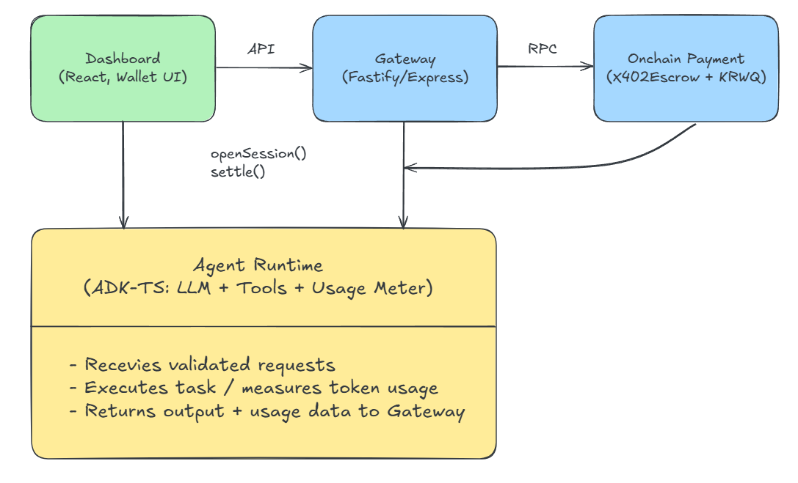

# 💡 Concept & Vision: Empowering the Autonomous Agent

## The Current Bottleneck: Limits of Access

* An overwhelming number of AI Agents are emerging, yet the gap between individual utilization capabilities is widening rapidly.
* The full potential of these agents often hits a wall due to **resource access restrictions**.
* We believe that to utilize an Agent not merely as a "smart assistant" but as an **"Autonomous, Acting Entity,"** we must grant it the **authority to access and transact resources**.

---

## EmpAI's Leap: From User to Operator

EmpAI addresses this limitation by implementing a payment mechanism compliant with the **X402 Protocol** (HTTP 402 Payment Required) using the **ADK-TS engine**.

* **Paradigm Shift:** By integrating economic accountability, we enable a leap from merely **'using the AI'** to **'operating and entrusting economic actions to the AI'**.
* **Future Synergy:** This structure aligns perfectly with the current trend of **stablecoin regulation** (such as KRW stablecoins), creating powerful synergy that connects **AI-driven payments** directly to the **on-chain economy**.

## 🏗️ Architecture

## 💻 Tech Stack

| Category | Key Technologies | Description |
| :--- | :--- | :--- |
| **Smart Contracts** | Solidity, Foundry | X402Escrow.sol, RateCardRegistry.sol. Session-based payment and settlement logic using KRWQ (ERC-20 stablecoin). |
| **Agent Runtime** | ADK-TS | LLM toolchain, usage metering, voucher verification. Core pipeline: Input → Reasoning → Action → Output. |
| **Gateway (API Server)** | Node.js, Fastify, Express | X402 voucher validation middleware. On-chain settlement (settle()) via RPC calls. |
| **Frontend** | React, Vite, TailwindCSS, Wagmi + Viem | KRWQ deposit, session creation/refund UI. Flow: Connect Wallet → Approve → Open Session → Call Agent → Settle → Close. |
| **Infrastructure** | IQAI ATP (EVM-based), QuickNode RPC | On-chain interaction and x402 transaction verification. |
| **Tooling** | Forge, Cast, pnpm, TypeChain | Contract compilation & testing. SDK generation and type automation. |